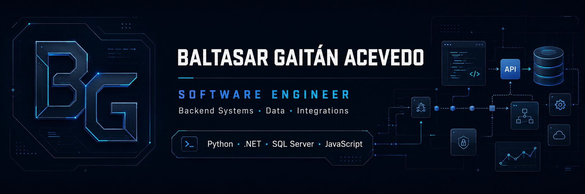

  

# Baltasar Gaitán Acevedo

### Software Engineer

**Backend Systems · Data · Integrations**

Building reliable software, data-intensive applications and system integrations with a focus on **architecture, performance and production-ready engineering**.

 

 

`Python` · `Django` · `C#/.NET` · `JavaScript` · `SQL Server` · `REST APIs`

Based in: Córdoba, Argentina · Open to remote & international opportunities · EU citizen

---

## About

I'm a **Software Developer and Information Systems Engineering student** focused on backend systems, data workflows and external integrations.

I work on software that has to operate beyond the development environment: APIs, SQL Server processes, stored procedures, scheduled workflows, third-party integrations, debugging, application logs and production support.

I enjoy engineering problems where **software architecture, data, performance and reliability intersect**.

---

# Featured Project

<table>
<tr>
<td width="100%" valign="top">

## PROGISS

### Data-Rich Management & Analytics Platform

**Python · Django · JavaScript · pandas · NumPy · scikit-learn · SciPy · Plotly · Matplotlib · SQLite**

PROGISS is a full-stack web application designed for health mutuals and insurance environments, combining **operational management, data processing, analytics, statistics and interactive visualization** in one platform.

### Engineering Scope

| Area                        | Implementation                       |
| --------------------------- | ------------------------------------ |
| **Backend**                 | Python · Django                      |
| **Frontend**                | JavaScript · HTML · CSS              |
| **Data Processing**         | pandas · NumPy                       |
| **Analytics**               | Statistical processing and reporting |
| **Predictive Capabilities** | scikit-learn · SciPy                 |
| **Visualization**           | Plotly · Matplotlib                  |
| **Persistence**             | SQLite                               |

### What this project demonstrates

* Full-stack application development
* Data-intensive backend workflows
* Analytical and statistical processing
* Integration between backend and browser-based interfaces
* Interactive reporting and visualizations
* Applied Python beyond traditional CRUD development
* Product-oriented development around real operational requirements

 

### [Explore PROGISS →](https://github.com/baltasargaitan/ProGISS)

</td>
</tr>
</table>

---

## Selected Engineering Work

<table>
<tr>

<td width="50%" valign="top">

### Sistema Sismógrafos

**Enterprise-style system architecture**

A full-stack seismic inspection management system focused on structured domain logic and maintainable application architecture.

**Engineering highlights**

* ASP.NET Core 8
* Entity Framework Core
* SQL Server
* React + Vite
* REST / JSON
* Clean Architecture
* Repository pattern
* Unit of Work
* Observer design pattern

 

[Explore repository →](https://github.com/baltasargaitan/SistemaSismografos)

</td>

<td width="50%" valign="top">

### Green Coding Experiment

**Performance × Sustainability**

Experimental engineering study analyzing the impact of algorithmic efficiency on execution time, energy consumption and carbon emissions.

**Measured results**

* **49.2%** less execution time
* **49.5%** less energy consumption
* **49.5%** less CO₂eq emissions
* **1.97×** higher throughput

 

`Python` · `CodeCarbon` · `Algorithms` · `Benchmarking`

 

[Explore case study →](https://github.com/baltasargaitan/green-code-codecarbon)

</td>

</tr>
</table>

---

## Engineering Stack

<table>

<tr>
<td width="22%"><strong>Backend</strong></td>
<td>Python · Django · C# · .NET · ASP.NET · Node.js</td>
</tr>

<tr>
<td><strong>Data</strong></td>
<td>SQL Server · T-SQL · Stored Procedures · pandas · NumPy · SQLite</td>
</tr>

<tr>
<td><strong>Integrations</strong></td>
<td>REST APIs · Web Services · JSON · External System Integration · Messaging</td>
</tr>

<tr>
<td><strong>Frontend</strong></td>
<td>JavaScript · React · HTML · CSS</td>
</tr>

<tr>
<td><strong>Analytics</strong></td>
<td>Plotly · Matplotlib · scikit-learn · SciPy · SSRS</td>
</tr>

<tr>
<td><strong>Reliability</strong></td>
<td>Debugging · Application Logs · Retry Workflows · Scheduled Jobs · Production Support</td>
</tr>

<tr>
<td><strong>Platform</strong></td>
<td>Git · IIS · PowerShell · Windows</td>
</tr>

</table>

---

## Production Engineering

### Software Developer · Desol

`Mar 2025 — Present`

Working across enterprise software, backend services, databases and external integrations.

My production experience includes:

* Designing and maintaining SQL Server data workflows
* T-SQL, Stored Procedures and complex relational queries
* REST APIs, Web Services and JSON integrations
* Third-party platform and messaging integrations
* End-to-end debugging across applications and databases
* Application and integration log analysis
* Retry mechanisms and recovery workflows
* Scheduled processes and SQL Server Agent Jobs
* QA and production validation
* IIS and PowerShell-based environments
* SSRS analytics and reporting

---

## How I Approach Engineering

<table>
<tr>

<td width="33%" valign="top">

### 01 · Understand

Start from the business requirement, system behavior or production issue.

Identify dependencies, data flows and failure points before modifying the system.

</td>

<td width="33%" valign="top">

### 02 · Engineer

Build solutions with maintainability, observability and operational behavior in mind.

Architecture and reliability matter as much as making the happy path work.

</td>

<td width="33%" valign="top">

### 03 · Validate

Debug, inspect logs, query data and validate expected behavior before considering a change complete.

Production behavior is the final source of truth.

</td>

</tr>
</table>

---

## Current Focus

`Backend Architecture` · `Reliable Integrations` · `Data-Intensive Applications`

`API Design` · `Software Performance` · `Testing & CI/CD` · `Engineering Automation`

I'm currently strengthening my engineering portfolio around **production-oriented backend development, software reliability, automated testing and modern delivery workflows**.

---

## Education

### Information Systems Engineering

**Universidad Tecnológica Nacional — Facultad Regional Córdoba**

2023 — Present

 

### Advanced Full Stack Developer

**ITBA — School of Innovation**

2024

Full-stack web development · JavaScript · Node.js · Django · REST APIs · Databases

---

## Let's Connect

I'm interested in software engineering opportunities involving **backend systems, Python, .NET, data, APIs and integrations**.

 

 

**Build software that is understandable, reliable and useful.**

